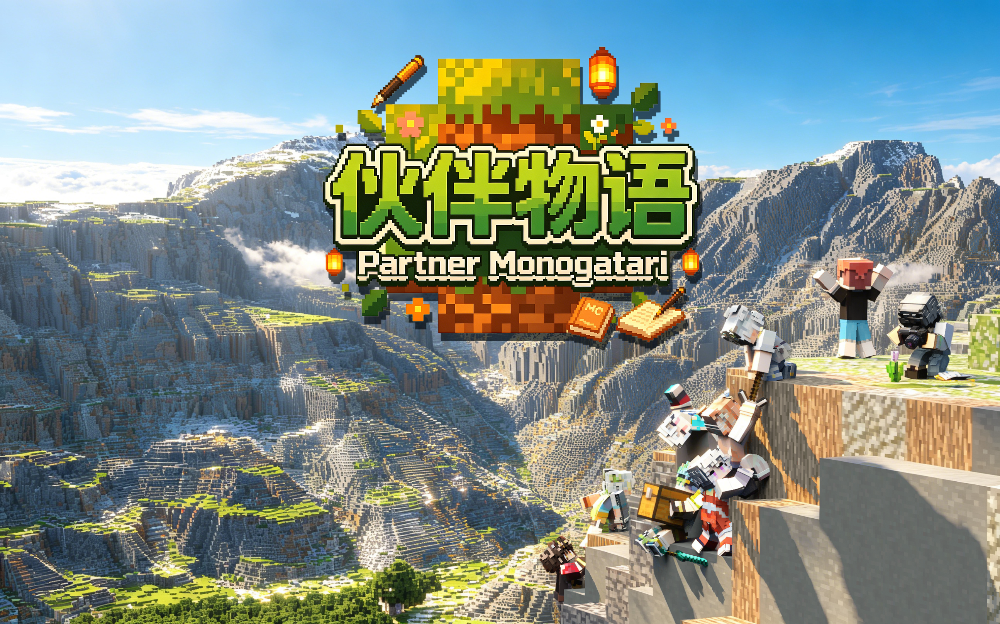

  

<h1 align="center">Partner Monogatari</h1>
<h3 align="center">伙伴物语</h3>

Minecraft 1.20.1 Forge 伴侣系统模组

  召唤并培养属于你的伙伴角色，在方块世界中并肩冒险。

---

## 伙伴与成长

- **27 位伙伴角色**，每位拥有独特的外观、技能与战斗风格
- **技能轮盘**：长按 F 键打开径向选择菜单，松开释放选中技能
- **成长系统**：升级、分配属性点（攻击 / 防御 / 速度 / 工作）、训练强化、洗点重置
- **捕获石**：投掷捕获石捕获野生看守者，将其转化为可培养的伙伴

## 战斗与 AI

- 智能战斗 AI：自动索敌、近战 / 远程切换、盾牌格挡、友军识别、哨卫模式
- 远程武器支持：弓箭、弩、TACZ 枪械（含射击动画与后坐力）
- 多类型技能释放：瞬发、吟唱、持续、被动，支持锚点追踪与阶段性效果
- 自定义状态效果：蓄力攻击、治愈增幅、石化、停滞等
- 坟墓与复活系统：伙伴阵亡后生成墓碑，支持复活器 UI 与强制复活

## 互动与日常

- **抚摸交互**：抚摸伙伴获得战斗加成，附带可爱的客户端动画反馈
- **待机卖萌**：玩家挂机时，伙伴有概率执行前倾摇臀的可爱动画
- **大狐狸坐骑**：专属坐骑，含骑乘 AI、跟随逻辑与日夜切换的喷火反击系统
- **自动药水**：伙伴背包中的药水瓶在血量过低时自动使用
- **繁殖系统**：伙伴可以繁殖培育后代
- **学校维度**：自定义维度与传送门，12 位 NPC 居民右键可交互对话

## 队伍与后勤

- **队伍管理**：召唤 / 召回、队伍编组、仓库存储、跟随距离配置
- **工作系统**：农场耕种、精华生产、巡逻、摇曲柄
- **背包管理**：自动拾取、自动进食、装备同步、快捷整理

## 世界与集成

- **学校维度**：和平模式、命令方块安全兜底、机制清理
- **僵尸村民皮肤替换**：7 种全新僵尸系实体皮肤
- **帕秋莉手册**：游戏内伙伴物语指南
- **TACZ 兼容**：与 Timeless and Classics Zero 枪械模组联动
- **HUD 系统**：队伍状态叠加层、药水效果图标、技能冷却显示

---

  <a href="https://github.com/Paltrow-Studio/ShotaPartner">主仓库</a>

